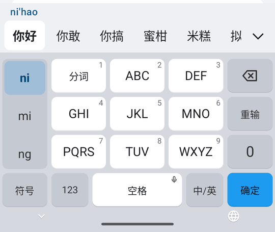
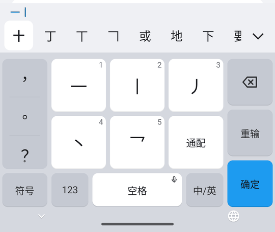
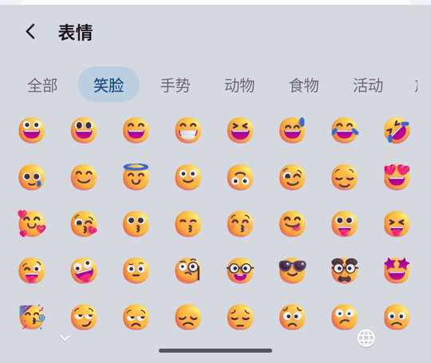
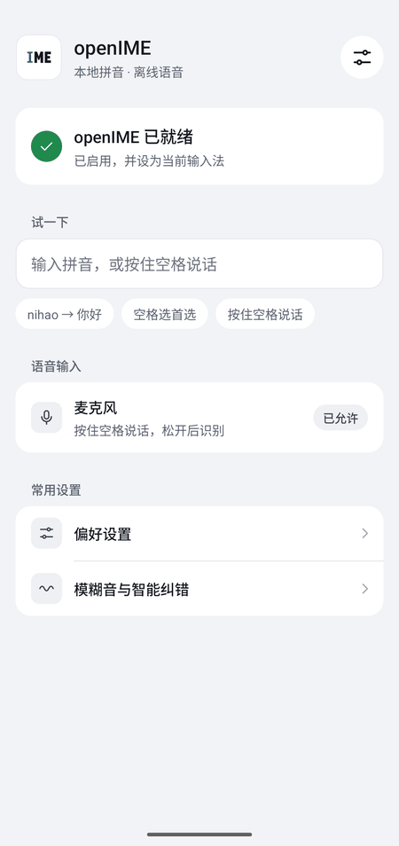
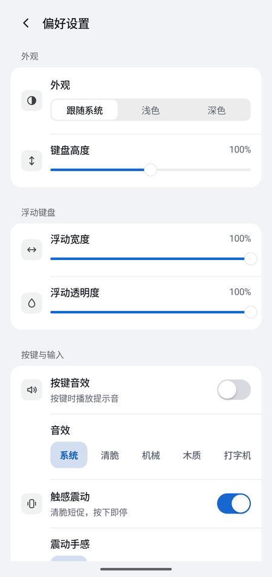
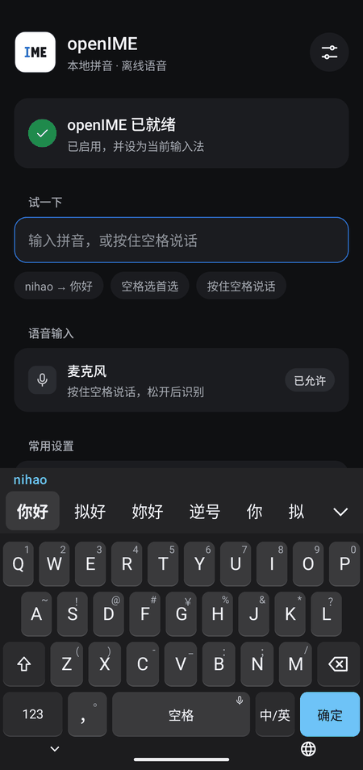
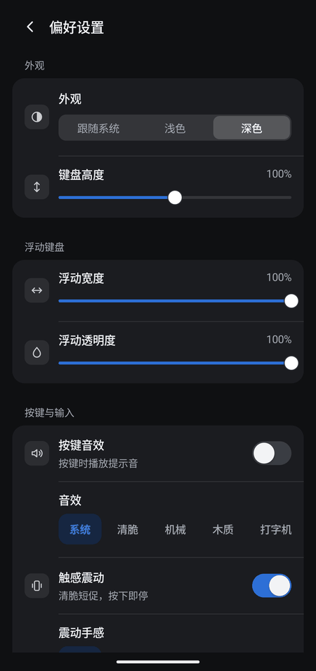

<p align="center">
  
</p>

<h1 align="center">openIME</h1>

<p align="center"><strong>本地优先的 Android 中文输入法</strong></p>

<p align="center">
  <a href="https://github.com/Slacker-LLC/openIME/releases"></a>
  <a href="https://github.com/Slacker-LLC/openIME/actions/workflows/android.yml"></a>
  <a href="LICENSE"></a>
</p>

<p align="center"><a href="README.md">English</a> · 简体中文</p>

> **当前处于 Beta 测试阶段（0.0.x）。** 功能和稳定性仍在验证，接口与数据格式可能调整，
> 请不要把它作为日常唯一的输入法。欢迎通过 [Issues](https://github.com/Slacker-LLC/openIME/issues) 反馈问题。

openIME 是一款独立的 Android 系统输入法。拼音候选、用户词库学习和语音识别全部在设备本地完成，
应用**没有 `INTERNET` 权限**，输入内容不会离开手机。

<table>
  <tr>
    <td></td>
    <td></td>
    <td></td>
    <td></td>
  </tr>
  <tr align="center">
    <td>26 键拼音</td><td>九键拼音</td><td>笔画</td><td>表情</td>
  </tr>
  <tr>
    <td></td>
    <td></td>
    <td></td>
    <td></td>
  </tr>
  <tr align="center">
    <td>首页</td><td>偏好设置</td><td>深色模式</td><td>深色设置</td>
  </tr>
</table>

## 功能

- **键盘**：26 键拼音、九键拼音、笔画、英文 26 键、数字与符号；Emoji、符号、剪贴板、文本编辑、浮动键盘。
- **拼音**：全拼、简拼、手动分词、候选展开、用户词库学习、简繁转换。
  引擎为 librime，内置约 90 万条 Rime Ice 词典记录，打包时已预先编译；安装或升级后第一次打开键盘，几秒内即可用完整词典。
- **九键**：输入时左栏列出下一个字的拼音，一个字选一个音节，选定后自动移到下一个字。
- **语音输入**：长按空格说话，松手后识别并上屏；使用内置的中英双语模型，不联网；可去掉“嗯”“呃”等语气词，也可把标点写成空格。
- **手势**：删除键上滑清空；空格左右滑动移动光标，滑动时底行其他按键锁定。
- **表情联想**：选词后联想栏先给出相关表情（开心 → 😊），词表内置，不联网。
- **自动填充**：Android 11+ 上，密码管理器的账号、验证码直接显示在键盘工具栏位置。
- **数字和符号**：26 键字母键右上角印着数字和符号，上滑或长按直接输入。
- **适配**：横竖屏、平板与折叠屏、深色模式、大字号；终端、远程桌面、游戏等原始按键输入框；
  外接键盘可直接打拼音。详见 [兼容性说明](docs/COMPATIBILITY.md)。
- **自我保护**：连续崩溃或卡死后自动进入安全模式，保证仍然可以打字；
  “设置 → 关于与数据”下，“关于”可复制诊断信息，“数据管理”可导出、导入用户数据。

## 下载与安装

1. 在 [Releases](https://github.com/Slacker-LLC/openIME/releases) 下载最新的 `openIME-v*-arm64-release.apk`。
   发布包仅支持 `arm64-v8a` 设备（绝大多数近年的 Android 手机），系统要求 Android 8.0（API 26）及以上。
2. 对照发布说明里的 SHA-256 校验后再安装：

   ```bash
   sha256sum openIME-v*-arm64-release.apk
   ```

3. 打开 openIME，按引导启用输入法并切换到 openIME。
4. 如需语音输入，在引导页授权麦克风；不授权也不影响普通打字。
5. 在引导页的输入框里试打一下，确认键盘、候选和上屏正常。

所有发布包使用同一把固定密钥签名，证书 SHA-256 见 [docs/release-cert.sha256](docs/release-cert.sha256)，
同一把密钥签名的新版本可以直接覆盖安装。

### 已知限制

- 手写输入尚未接入识别引擎，入口默认隐藏。
- 九键暂不支持与外接键盘同时使用。
- 部分厂商系统对输入法的后台限制不同，尚未在大量真机上验证。
- 版本号小于此前已装版本时，系统会拒绝覆盖安装；需要先卸载（卸载前可导出用户数据）。

## 隐私与安全

- 应用不声明 `INTERNET` 权限，`allowBackup` 关闭；词典、语音模型和 runtime 都随 APK 提供。
- 语音音频只在内存中处理，结束、取消或失败时清空，不落盘。
- 密码输入框不组合拼音、不学习词库、不读取输入框内容、不写日志；可使用剪贴板历史（来源应用标记为敏感的内容和要求关闭个性化学习的输入框除外）；语音可用，识别结果只在结束时一次性上屏。
- 崩溃记录只保存异常类型和调用栈，不含输入内容。
- 卸载会清除本机全部数据，包括学习到的用户词库。

发现安全问题请不要直接创建公开 Issue，按 [SECURITY.md](SECURITY.md) 私下报告。

## 参与开发

环境要求：JDK 17、Android SDK Platform 36、NDK `27.0.12077973`、CMake `3.22.1`、Git LFS。

```bash
git lfs install && git lfs pull        # 语音模型与 sherpa-onnx AAR
bash scripts/fetch_rime_deps.sh        # 锁定版本的 librime 原生依赖
./gradlew :app:assembleDebug           # 输出 app/build/outputs/apk/debug/app-debug.apk
bash scripts/verify_linux.sh           # 单元测试、Lint、Debug APK、仪器测试 APK
```

Debug 包仅用于开发与回归（含 `x86_64`），带调试用 Activity 和 Receiver，不会随正式包发布。
在设备上安装与启用：

```bash
adb install -r app/build/outputs/apk/debug/app-debug.apk
adb shell ime enable --user 0 llc.slacker.openime/.LocalVoiceImeService
adb shell ime set --user 0 llc.slacker.openime/.LocalVoiceImeService
```

仓库结构：

```text
app/          Android 应用、输入法服务、Rime JNI、内置模型与词典
scripts/      构建、回归、发布脚本
docs/         架构、兼容性、测试、发布与仓库管理文档
.github/      CI、发布流水线、Dependabot、Issue 与 PR 模板
VERSION       版本号的唯一来源
CHANGELOG.md  变更记录，同时是 Release 说明的来源
```

文档入口（英文）：

- [文档索引](docs/README.md)　[架构](docs/ARCHITECTURE.md)　[兼容性](docs/COMPATIBILITY.md)
- [测试流程](docs/TEST_SOP.md)　[脚本说明](scripts/README.md)
- [发布流程](docs/RELEASE.md)　[仓库设置](docs/REPOSITORY.md)　[贡献指南](CONTRIBUTING.md)

## 许可证

openIME 以 [GPL-3.0-only](LICENSE) 发布。第三方组件保留各自的许可证，
见 [docs/LICENSING.md](docs/LICENSING.md) 和 [THIRD_PARTY_NOTICES.md](THIRD_PARTY_NOTICES.md)。
